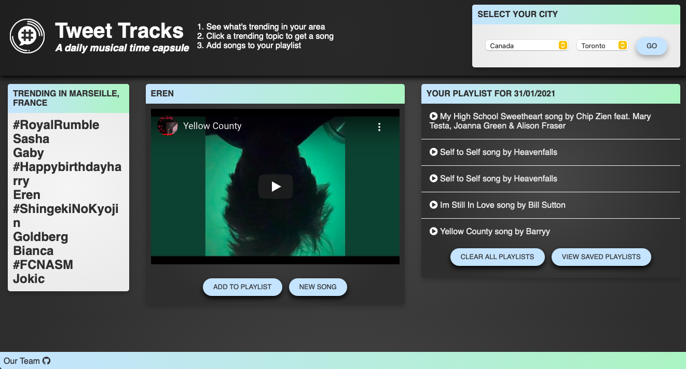

# Tweet Tracks
A muscical time capsule! Plays a song that has a trending topic of the day from Twitter in the lyrics.

<!-- edit this part -->
## Screenshot of the webpage

## Description
- This project is a purely front-end web application that finds a list of trending topics from Twitter by user's desired location and plays a song from YouTube that has the user's choice of topic in the lyrics.
- Webscraped trends24 website to get the trending topics from Twitter.
- Used Musixmatch API to search for a song that has the trending topic in the lyrics.
- Utilized Youtube API to play the song
- saved songs render in a playlist on the page and are saved in localStorage

## How to use
- Under SELECT YOUR CITY box, select your choice of location, either a country or a city and click the button GO to search for trending topics.
- Under TRENDING IN box, click on one of the trending topics to play a song.
- If you like to save the song to your playlist, click ADD TO PLAYLIST button.
- Click NEW SONG to get a new song for the selected trend.
- Click VIEW SAVED PLAYLISTS to view playlists from past days.

